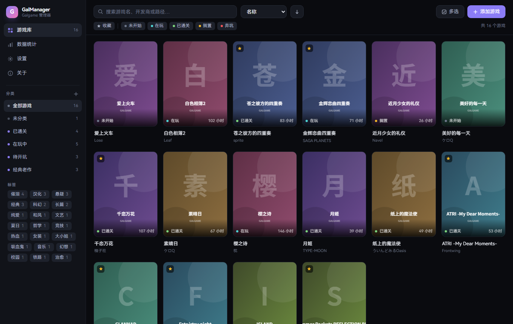
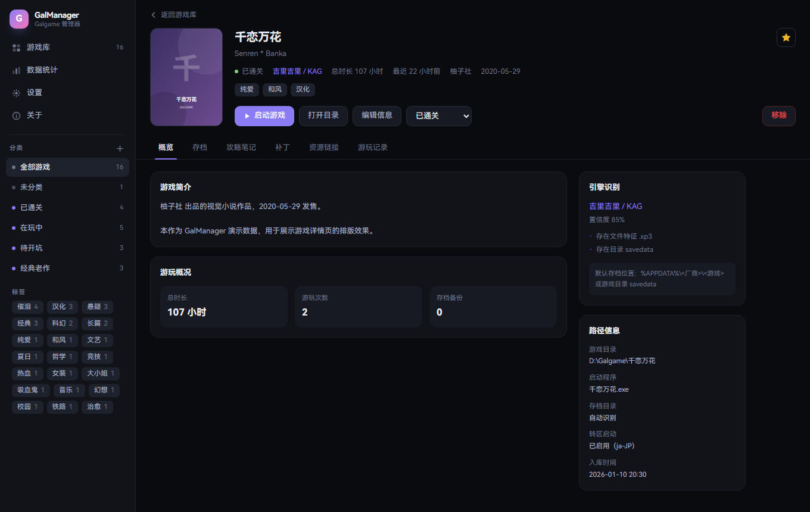
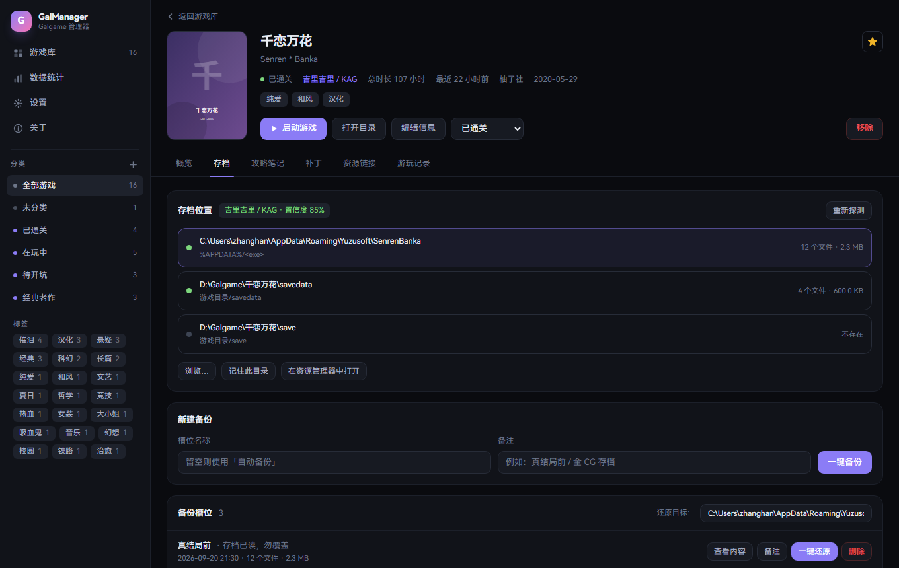
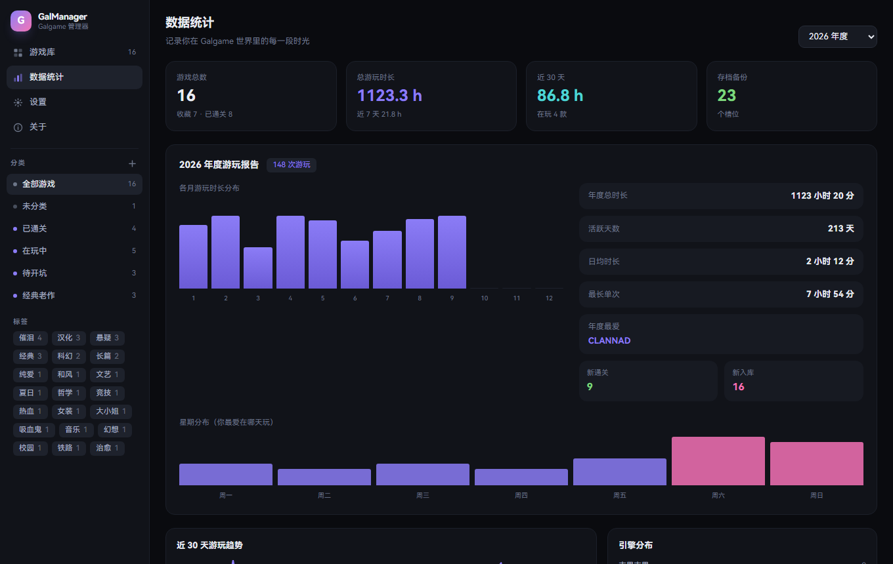
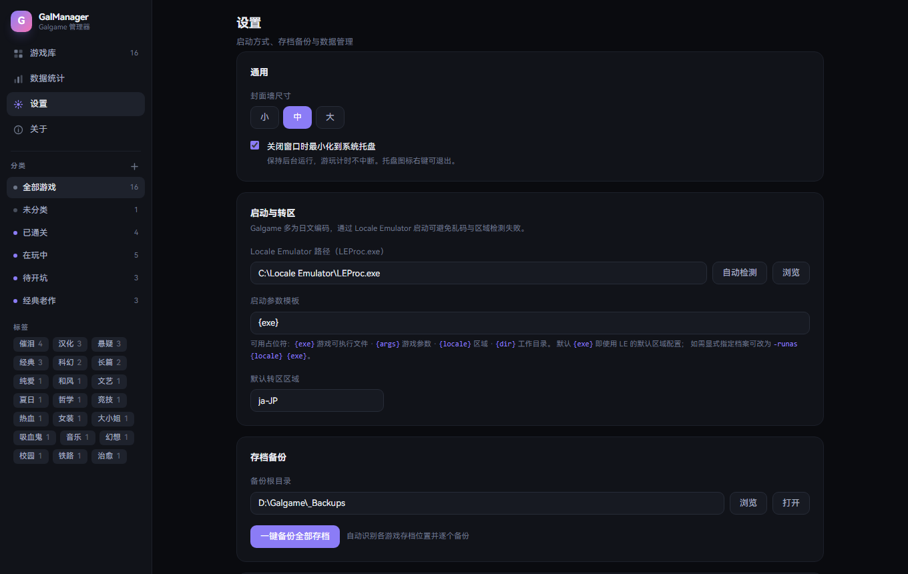
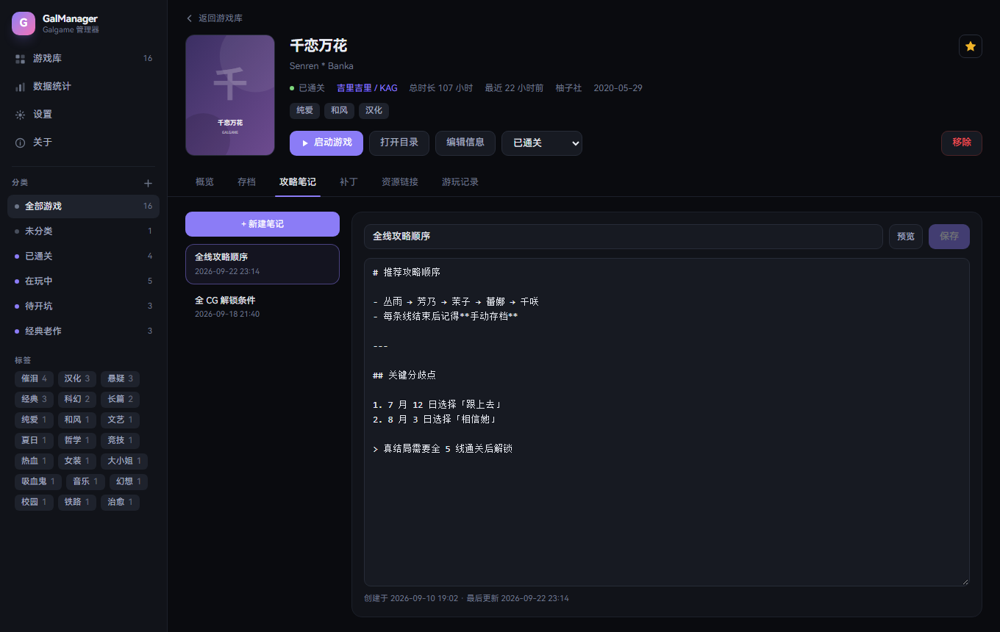

<div align="center">


# GalManager

**Galgame 专属桌面管理器**

把散落在各个硬盘角落的视觉小说，整理成一座属于你自己的封面墙。

[](https://tauri.app)
[](https://vuejs.org)
[](https://www.typescriptlang.org)
[](https://www.rust-lang.org)

</div>

---

## 目录

- [简介](#简介)
- [功能特性](#功能特性)
- [界面预览](#界面预览)
- [技术栈](#技术栈)
- [快速开始](#快速开始)
- [打包安装包](#打包安装包)
- [使用说明](#使用说明)
- [引擎与存档路径](#引擎与存档路径)
- [项目结构](#项目结构)
- [常见问题](#常见问题)
- [致谢](#致谢)

---

## 简介

GalManager 是一款面向 Galgame 玩家的**本地**游戏库管理器。它不做下载、不做分发，只专注一件事：
**把你已经拥有的游戏管理好**。

- 扫描本地文件夹，自动识别游戏目录、启动程序与引擎类型
- 封面墙为主视觉的浏览体验，配合分类、标签、搜索与筛选
- 自动定位各引擎的存档目录，一键备份 / 还原
- 集成 Locale Emulator，一键以日文区域启动，告别乱码
- 后台自动计时，沉淀出属于你的年度游玩报告

数据全部存放在本地 SQLite，不联网、不上传。

---

## 功能特性

### 游戏库

| 能力 | 说明 |
| --- | --- |
| 封面墙 | 自适应网格（小 / 中 / 大三档），无封面时按标题生成稳定的渐变占位 |
| 分类侧边栏 | 自定义分类，实时统计数量，支持「未分类」视图 |
| 标签系统 | 多对多标签，侧边栏点击即筛，支持批量打标 |
| 搜索筛选 | 关键词（名称 / 原名 / 开发商 / 路径）、游玩状态、收藏、引擎多维组合 |
| 排序 | 名称、最近游玩、游玩时长、评分、发售日期、入库时间 |
| 多选批量 | 批量改分类 / 改状态 / 收藏 / 加标签 |
| 右键菜单 | 查看详情、启动、打开目录、编辑、移除 |
| 游戏详情页 | 概览、存档、攻略笔记、补丁、资源链接、游玩记录六大分区 |

### 扫描与识别

- **递归扫描**：可调 1–6 层深度，自动剪枝系统目录、运行时目录、补丁目录
- **可执行文件识别**：过滤卸载程序、DirectX / VC++ 安装器、崩溃处理器等噪声
- **名称清洗**：`[1103] 千恋万花 (完全版)` → `千恋万花`
- **启动项排序**：汉化版 exe、中文名 exe、与游戏同名的 exe 优先
- **引擎识别**：多信号加权打分，输出置信度与命中证据

### 存档管理

- 按引擎规则自动探测存档目录，列出全部候选并标注文件数与体积
- 支持手动指定并「记住」存档目录
- 备份为 zip 归档（含 `manifest.json` 元信息），脱离本应用也能直接解压取回
- 多槽位 + 自定义备注 + 归档内容预览
- **还原前自动留档**：覆盖前把现有存档另存为 `xxx.before_restore_<时间戳>`
- 一键批量备份全部游戏

### 启动与统计

- 集成 **Locale Emulator**，参数模板可自定义（`{exe}` / `{args}` / `{locale}` / `{dir}`）
- 自动探测 LE 安装路径，无需手动配置
- 启动后按进程名轮询存活状态（兼容 LE 拉起子进程、游戏自我重启）
- 自动累计游玩时长、生成会话记录与时间线
- 年度报告：月度分布、星期分布、活跃天数、最长单次、年度最爱、时长排行

### 辅助工具

- **攻略笔记**：内嵌 Markdown 编辑器 + 预览
- **汉化补丁管理**：登记补丁版本、类型、本地文件与下载链接，标记安装状态
- **资源链接收藏**：攻略 Wiki、补丁发布页、视频、论坛分类归档

### 桌面体验

- 极简深色 UI，紫罗兰 / 玫瑰粉配色
- 窗口大小位置记忆
- 关闭窗口最小化到系统托盘，游玩计时不中断
- 单实例运行，二次启动自动唤回已有窗口
- 运行日志自动落盘，便于排查问题

---

## 界面预览

> 全部截图位于 `screenshots/` 目录，采用演示数据生成（见 `scripts/mock.html`）。

**游戏库 · 封面墙主视觉**



**游戏详情页 · 引擎识别与路径信息**



**存档管理 · 自动探测路径与多槽位备份**



**数据统计 · 年度游玩报告**



**设置 · 转区启动与数据管理**



**攻略笔记 · 内嵌 Markdown 编辑器**



---

## 技术栈

| 层 | 选型 | 说明 |
| --- | --- | --- |
| 桌面框架 | Tauri 2 | Rust 后端 + 系统 WebView，安装包体积小、内存占用低 |
| 前端 | Vue 3 + TypeScript | `<script setup>` 组合式 API |
| 样式 | Tailwind CSS 4 | `@theme` 定义设计令牌，零运行时开销 |
| 状态 | Pinia | 游戏库与设置两个 store |
| 路由 | Vue Router | hash 模式，适配 Tauri 本地资源加载 |
| 后端 | Rust | 扫描、引擎识别、存档、启动、统计 |
| 数据库 | SQLite（rusqlite bundled） | 静态编译，用户无需额外安装 |
| 归档 | zip (deflate) | 存档备份格式 |
| 进程 | sysinfo | 游玩时长监控 |

---

## 快速开始

### 直接安装（普通用户）

从 [Releases](../../releases) 页面下载最新安装包，二选一：

| 文件 | 说明 |
| --- | --- |
| `GalManager_x.y.z_x64-setup.exe` | NSIS 安装程序，安装时可选简体中文 / English，推荐 |
| `GalManager_x.y.z_x64_zh-CN.msi` | MSI 安装包，适合需要组策略批量部署的场景 |

安装过程无需管理员权限（按当前用户安装）。首次启动若被 Windows SmartScreen 拦截，
点「更多信息」→「仍要运行」即可 —— 安装包未做代码签名，属正常现象。

> 也提供免安装的 `GalManager.exe`，解压后直接运行，适合放在 U 盘随身携带。

### 环境要求（开发者）

- **Node.js** ≥ 20（推荐 22）
- **pnpm** ≥ 9
- **Rust** ≥ 1.77（建议用 [rustup](https://rustup.rs/) 安装）
- **Windows 10/11**（当前主要支持平台）

### 开发运行

```bash
# 1. 安装依赖
pnpm install

# 2. 启动开发模式（自动拉起 Vite 与 Tauri）
pnpm tauri dev
```

首次运行会编译 Rust 依赖，耗时较长（约 5–15 分钟），之后增量编译很快。

### 常用命令

```bash
pnpm dev            # 只启动前端（浏览器调试用）
pnpm build          # 类型检查 + 构建前端产物
pnpm typecheck      # 仅类型检查
pnpm tauri build    # 构建 Windows 安装包
```

---

## 打包安装包

```bash
pnpm tauri build
```

产物位于 `src-tauri/target/release/bundle/`：

| 格式 | 路径 | 体积 |
| --- | --- | --- |
| NSIS 安装程序（.exe） | `bundle/nsis/GalManager_0.1.0_x64-setup.exe` | 约 2.2 MB |
| MSI 安装包 | `bundle/msi/GalManager_0.1.0_x64_zh-CN.msi` | 约 3.0 MB |
| 免安装可执行文件 | `target/release/GalManager.exe` | 约 5.6 MB |

安装向导支持简体中文 / English 语言选择，默认按「当前用户」安装，无需管理员权限。
免安装版直接双击 `GalManager.exe` 即可运行，但不会创建开始菜单快捷方式。

### 重新生成图标

```bash
python scripts/generate_icon.py      # 生成 1024x1024 源图
pnpm tauri icon scripts/assets/icon.png
```

---

## 使用说明

### 1. 添加游戏

点击右上角 **添加游戏** → 选择游戏根目录 → 选择扫描模式：

- **按启动程序**：递归查找含 `.exe` 的目录，每个目录视为一个游戏。适合结构规整的库。
- **按一级目录**：把根目录下每个一级子目录都当作一个游戏。适合「一个游戏一个文件夹」的库。

扫描结果会标注引擎类型与置信度，已入库的路径会自动置灰。勾选后点击导入即可。

### 2. 启动游戏

- 直接点封面上的播放按钮即可启动。
- 日文游戏请在编辑信息中勾选 **使用 Locale Emulator 转区启动**。
- 首次使用前，到 **设置 → 启动与转区** 点「自动检测」配置 `LEProc.exe` 路径。

### 3. 存档备份

进入游戏详情 → **存档** 页签：

1. 应用会自动探测存档目录，绿色圆点表示目录存在且有内容。
2. 选中目录 → 填写槽位名称与备注 → **一键备份**。
3. 需要回滚时点 **一键还原**，还原前会自动把现有存档另存一份。

> 提示：多数游戏需要先启动一次并手动保存，才会生成存档文件。

### 4. 查看统计

侧边栏进入 **数据统计**，可切换年份查看年度报告；游戏详情 → **游玩记录** 可看到逐次会话的时间线。

### 5. 托盘与退出

点击窗口关闭按钮默认最小化到系统托盘（可在设置中关闭）。
**右键托盘图标 → 退出 GalManager** 才是真正退出。

---

## 引擎与存档路径

| 引擎 | 识别特征 | 默认存档位置 |
| --- | --- | --- |
| 吉里吉里 / KAG | `*.xp3`、`savedata/` | `%APPDATA%\<厂商>\<游戏>` 或游戏目录 `savedata` |
| Ren'Py | `*.rpa`、`renpy/` | `%APPDATA%\RenPy\<游戏>`（优先读 `options.rpy` 声明） |
| Unity | `UnityPlayer.dll`、`*_Data/` | `%USERPROFILE%\AppData\LocalLow\<公司>\<产品>`（解析 `app.info`） |
| RPG Maker XP/VX/VA | `*.rxproj`、`*.rvdata*` | 游戏目录 `Save*.rvdata` |
| RPG Maker MV/MZ | `nw.dll`、`www/` | `www\save` 或 `%LOCALAPPDATA%\<游戏>` |
| NScripter | `nscript.dat`、`arc.nsa` | 游戏目录 |
| SiglusEngine | `Scene.pck` | `%APPDATA%\<游戏>` 或游戏目录 `savedata` |
| RealLive | `Seen.txt`、`*.g00` | 游戏目录 |
| BGI / Ethornell | `*.arc`、`BGI.exe` | 游戏目录 `save` 或 `%APPDATA%\<游戏>` |
| Artemis Engine | `*.pfs`、`*.afa` | 游戏目录 `savedata` |
| CatSystem2 | `*.cst`、`cs2conf.dll` | 游戏目录 `save` 或 `%APPDATA%\<游戏>` |
| WOLF RPG Editor | `Data.wolf` | 游戏目录 `Data\SaveData` |
| Majiro | `*.mjo` | 游戏目录 `save` |
| SystemNNN | `SystemNNN.exe` | 游戏目录 `save` |
| Unreal Engine | `*.pak`、`*.utoc` | `%LOCALAPPDATA%\<游戏>\Saved` |

未识别到引擎时，应用会回退到通用探测（游戏目录 `save` / `saves` / `savedata`、`%APPDATA%`、`%LOCALAPPDATA%`、`文档`），
也可以随时手动指定存档目录。

---

## 项目结构

```
GalManager/
├── src/                          # 前端（Vue 3 + TS）
│   ├── api/index.ts              # 后端命令的类型化封装（唯一 invoke 出口）
│   ├── components/
│   │   ├── AppSidebar.vue        # 分类侧边栏
│   │   ├── GameCard.vue          # 封面卡片
│   │   ├── ScanDialog.vue        # 扫描导入向导
│   │   ├── GameEditDialog.vue    # 游戏信息编辑
│   │   ├── BatchBar.vue          # 多选批量操作栏
│   │   └── detail/               # 详情页各面板
│   ├── stores/                   # Pinia：library / settings
│   ├── views/                    # 游戏库 / 详情 / 统计 / 设置 / 关于
│   ├── utils/                    # 格式化、Toast
│   └── style.css                 # Tailwind 主题令牌与组件基类
├── src-tauri/                    # 后端（Rust）
│   ├── src/
│   │   ├── lib.rs                # 应用入口、插件注册、命令表
│   │   ├── db.rs                 # SQLite 连接、Schema、全部查询
│   │   ├── models.rs             # 前后端共享数据结构
│   │   ├── scanner.rs            # 目录扫描与 exe 识别
│   │   ├── engine.rs             # 引擎识别规则
│   │   ├── savedata.rs           # 存档探测 / 备份 / 还原
│   │   ├── launcher.rs           # 启动、LE 转区、时长监控
│   │   ├── tray.rs               # 系统托盘
│   │   └── commands/             # Tauri 命令层
│   ├── capabilities/             # 权限声明
│   ├── icons/                    # 应用图标
│   └── tauri.conf.json           # 窗口 / 打包配置
├── scripts/                      # 开发辅助脚本
│   ├── generate_icon.py          # 程序化生成应用图标
│   ├── mock.html                 # Tauri IPC Mock（用于浏览器中预览 / 截图）
│   └── capture_screenshot.ps1    # 抓取窗口截图
└── screenshots/                  # README 配图
```

### 数据存放位置

```
%APPDATA%\com.galmanager.app\
├── galmanager.db      # SQLite 数据库
├── covers\            # 封面图缓存
├── saves\             # 存档备份归档（可自定义到其它盘）
└── logs\              # 运行日志
```

---

## 常见问题

**Q：扫描不到游戏？**
A：确认游戏目录下有 `.exe`；尝试切换到「按一级目录」模式；或把最大递归深度调大。
如果 exe 名称包含 `setup` / `uninstall` 等关键字会被自动过滤，可手动添加游戏。

**Q：启动游戏提示找不到启动程序？**
A：游戏目录结构变动过。进入游戏详情 → 编辑信息 → 重新选择启动程序（下拉框会自动列出目录下的 exe）。

**Q：转区启动报错？**
A：到 **设置 → 启动与转区** 检查 `LEProc.exe` 路径是否有效。若使用自定义 LE 配置档案，
可把参数模板改为 `-runas {locale} {exe}` 并在游戏信息里填写对应区域。

**Q：存档目录探测不准？**
A：部分游戏把存档写在注册表或 `我的文档` 下。可在存档页点击「浏览…」手动指定，
再点「记住此目录」，之后就会优先使用它。

**Q：游玩时长没统计上？**
A：计时依赖进程存活检测。若游戏通过启动器二次拉起、且进程名与配置的 exe 不同，
可能检测不到。可在编辑信息里把启动程序改为真正的游戏主程序。

**Q：如何彻底退出？**
A：右键系统托盘图标 → 退出 GalManager。

---

## 致谢

- 架构设计与引擎识别思路参考了开源项目 [ReinaManager](https://github.com/huoshen80/ReinaManager)，
  本项目针对 Vue 3 + Tailwind 技术栈重新实现。
- 转区能力依赖 [Locale Emulator](https://github.com/xupefei/Locale-Emulator)。
- 感谢所有为 Galgame 社区做出贡献的开发者与汉化组。

---

## 免责声明

本工具仅用于管理本地已合法获取的游戏，**不提供任何游戏内容下载、分发或破解功能**。
请支持正版。
